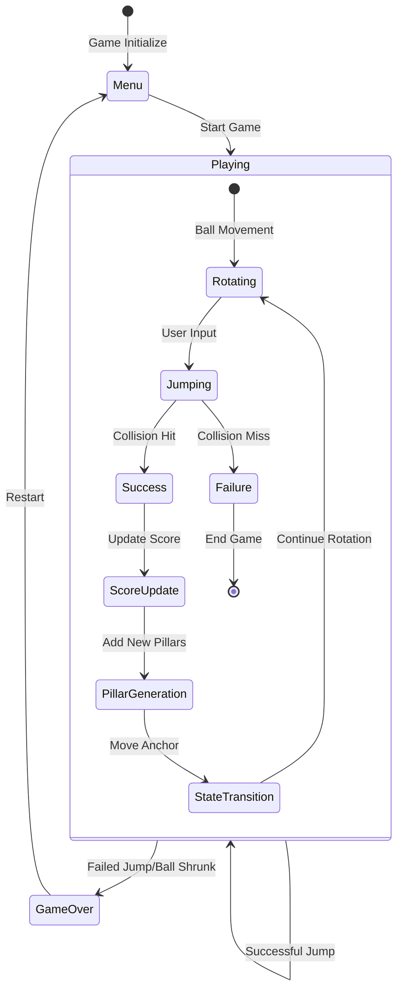
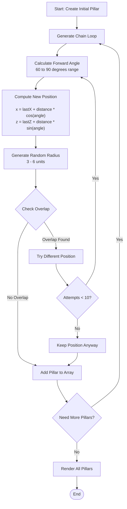
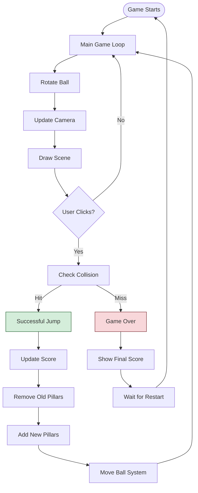

# Pillar Valley

[](https://developer.mozilla.org/en-US/docs/Web/HTML)
[](https://developer.mozilla.org/en-US/docs/Web/JavaScript)
[](https://developer.mozilla.org/en-US/docs/Web/API/Canvas_API)
[](https://threejs.org/)
[](https://jquery.com/)

> [!NOTE]
> **🎓 Academic Project**
> *This game was developed as an assignment project and submitted to:*
> **Mrs. Farhana Desai Ma'am**
>
> **For the course**: *Web Application Development (TE7750)*

## 🙏 Acknowledgements

**Original Concept**: This project is inspired by [Evan Bacon's Pillar Valley](https://github.com/EvanBacon/pillar-valley). The original idea and concept belong to [Evan Bacon](https://github.com/EvanBacon). This implementation serves as a learning exercise and academic project recreation.

## 🎮 [**Play the Game Live!**](https://bionicop.github.io/pillar-valley/)

## 📋 Table of Contents

1. [Acknowledgements](#-acknowledgements)
2. [Core Concept: Anchor & Orbit System](#core-concept-anchor--orbit-system)
3. [Game State Management](#game-state-management)
4. [Ball Mechanics & Physics](#ball-mechanics--physics)
5. [Pillar Generation System](#pillar-generation-system)
6. [Collision Detection](#collision-detection)
7. [Game Flow and Execution](#game-flow-and-execution)
8. [Visual System and Colors](#visual-system-and-colors)

---
## Core Concept: Anchor & Orbit System

### Game Mechanics Overview
Pillar Valley is an endless, minimalistic 3D arcade game built with `Three.js` and `jQuery`. Players navigate a dual-ball system across procedurally generated pillars in an infinite valley, aiming for the highest score through precise timing and strategic positioning.

### The Anchor & Orbit System
The central mechanic revolves around a stable, two-ball system designed for intuitive control and predictable physics.

*   **Anchor Ball (`centerBall`):** This ball remains visually fixed at the center of the current active pillar. It acts as the pivot point for the player's movement.
*   **Orbiting Ball (`activeBall`):** This ball continuously rotates around the Anchor Ball at a fixed radius. The player's only action is to time the jump of this ball.

Upon a successful jump, the entire anchor point seamlessly translates to the new pillar, and the Orbiting Ball continues its rotation from the new anchor, creating a fluid and continuous experience.

---

## Game State Management

### How Game State Works
The game maintains all its information in a single `game` object that tracks everything from ball position to score:

```javascript
let game = {
  // Core Game State
  playing: false,           // Game active status
  score: 0,                // Current score
  best: 0,                 // High score (localStorage)

  // Ball Physics State
  ballAngle: 0,            // Current rotation angle (0-360°)
  ballSpeed: CONFIG.SPEED[0], // Dynamic rotation speed
  ballScale: CONFIG.BALL_SHRINK[0], // Current size multiplier
  ballDirection: 1,        // Rotation direction (1/-1)
  ballPosition: { x: 0, z: 0 }, // Anchor position coordinates

  // World State
  pillars: [],             // Array of pillar objects
  cam: { x: 0, z: 0 },    // Camera position
  colors: {}               // Current color scheme
};
```

### State Flow Process
1. The Orbiting Ball rotates around the Anchor Ball
2. Player waits for the optimal angle to jump
3. Player clicks/taps to initiate a jump
4. System checks if the ball hits any pillar
5. On success: score updates, anchor moves, and loop continues
6. On failure: game ends



---

## Ball Mechanics & Physics
The ball system consists of two interconnected balls where one rotates around the other. Here's how it works:

**The Rotation Logic:**
Every frame, the system updates the angle of the orbiting ball. The angle increases continuously, creating smooth circular motion. The rotation speed starts at 3 and can increase up to 7 based on your score.

```javascript
function rotateBall() {
  if (!game.playing) return;

  // Update angle - this makes the ball move in a circle
  game.ballAngle = (game.ballAngle + game.ballSpeed * game.ballDirection) % 360;

  // Speed increases every 3 points
  game.ballSpeed = Math.min(
    CONFIG.SPEED[0] + Math.floor(game.score/3) * CONFIG.SPEED[2],
    CONFIG.SPEED[1]
  );

  // Ball gets smaller over time - this adds pressure
  if (game.score > 0) {
    game.ballScale = Math.max(
      game.ballScale - CONFIG.BALL_SHRINK[2],
      CONFIG.BALL_SHRINK[1]
    );
    if (game.ballScale <= CONFIG.BALL_SHRINK[1]) endGame();
  }

  updateBallPositions();
}
```

### Ball Position Calculation
Converting the angle into actual 3D positions is done using trigonometry:

```javascript
function updateBallPositions() {
  const ballY = CONFIG.PILLAR_HEIGHT + CONFIG.BALL_HEIGHT/2;
  const rad = game.ballAngle * Math.PI/180; // Convert to radians

  // Anchor ball stays at pillar center
  centerBall.position.set(
    game.ballPosition.x,
    ballY,
    game.ballPosition.z
  );

  // Orbiting ball moves in a circle around anchor
  activeBall.position.set(
    game.ballPosition.x + Math.cos(rad) * CONFIG.ROTATION_RADIUS, // X position
    ballY,
    game.ballPosition.z + Math.sin(rad) * CONFIG.ROTATION_RADIUS  // Z position
  );

  // Active ball shrink to increase difficulty
  activeBall.scale.setScalar(game.ballScale);
}
```

### Speed Progression System
The game gets harder as you score more points:
- **Formula**: `speed = min(initial + floor(score/3) × increment, maxSpeed)`
- Every 2 points increases speed by 0.45
- Maximum speed is capped at 7.0

---

## Pillar Generation System
Each pillar is a simple object with position and size:

```javascript
const pillar = {
  x: 0,       // World X coordinate
  z: 0,       // World Z coordinate
  r: 4.5,     // Pillar radius (random between 3-6 units)
};
```

### Pillar Generation Process
The system creates a path of pillars that leads forward but not in a straight line. Here's how it works:



### Overlap Prevention
The `hasOverlap()` function prevents pillars from being too close to each other:

```javascript
function hasOverlap(newPillar) {
  return game.pillars.some(existing =>
    distance(newPillar.x, newPillar.z, existing.x, existing.z) <
    (newPillar.r + existing.r + 3) // 3-unit safety buffer
  );
}
```

**How this works:**
- Calculate distance between new pillar and each existing pillar
- If distance is less than their combined radii plus 3 units, it's too close
- Return true to trigger regeneration

### Dynamic Pillar Management
When you successfully jump, the system removes old pillars and adds new ones:

```javascript
// Remove pillars you've passed
game.pillars.splice(0, hitIndex);

// Add new pillars to maintain count
while(game.pillars.length < CONFIG.PILLAR_COUNT) {
  const last = game.pillars[game.pillars.length-1];
  // Generate new pillar using forward angle (60-90 degrees)
  const angle = getNextAngle();
  // ... position calculation and overlap checking
}
```

### Visual Rendering
Pillars fade out as they get further away to create depth perception:

```javascript
function renderPillars() {
  game.pillars.forEach((pillar, i) => {
    const geometry = new THREE.CylinderGeometry(pillar.r, pillar.r, CONFIG.PILLAR_HEIGHT, 16);
    const material = new THREE.MeshLambertMaterial({
      color: game.colors.pillar,
      transparent: true,
      opacity: Math.max(1 - i * 0.1, 0.4) // Closer pillars = more opaque
    });
    // ... mesh creation and positioning
  });
}
```

---

## Collision Detection
The collision system calculates if the orbiting ball is close enough to any pillar when you jump:

```javascript
function checkBallCollision() {
  if (!game.playing || !game.pillars.length) return -1;

  // Calculate where the orbiting ball currently is
  const rad = game.ballAngle * Math.PI/180;
  const ballX = game.ballPosition.x + Math.cos(rad) * CONFIG.ROTATION_RADIUS;
  const ballZ = game.ballPosition.z + Math.sin(rad) * CONFIG.ROTATION_RADIUS;

  // Check against all pillars (skip index 0 - that's current pillar)
  for (let i = 1; i < game.pillars.length; i++) {
    const p = game.pillars[i];
    const distance = Math.sqrt((ballX - p.x)**2 + (ballZ - p.z)**2);

    if (distance <= p.r * CONFIG.TOLERANCE) return i;
  }

  return -1; // No collision detected
}
```

**Tolerance Factor**: `CONFIG.TOLERANCE = 0.9`: Basically, ball's center must be within 90% of pillar radius to count as a hit

---

## Game Flow and Execution

### Main Game Loop
The game runs continuously through this simple loop:

```javascript
function animate() {
  requestAnimationFrame(animate);
  update();                       // Update game state
  renderer.render(scene, camera); // Draw everything
}

function update() {
  if(!game.playing) return;

  rotateBall();               // Move the ball
  updateCameraFollow();       // Keep camera following action
}
```

### What Happens When You Jump
The `jump()` function handles everything that occurs when you click:

```javascript
function jump() {
  if(!game.playing) return;

  const hitIndex = checkBallCollision();
  if(hitIndex === -1) return endGame(); // Missed - game over

  // Successful jump sequence:
  game.score += hitIndex;                    // Add points based on how far you jumped
  game.best = Math.max(game.score, game.best); // Update high score
  localStorage.pillarsBest = game.best;      // Save to browser

  // Clean up world:
  game.pillars.splice(0, hitIndex);         // Remove passed pillars

  // Generate new pillars to keep the path going
  while(game.pillars.length < CONFIG.PILLAR_COUNT) {
    // ... pillar generation logic
  }

  // Update ball state for next round:
  game.ballScale = 1;                       // Reset shrinking
  game.ballDirection *= -1;                 // Reverse rotation direction
  game.ballAngle = (game.ballAngle + 180) % 360; // Flip to opposite side
  game.ballPosition = {                     // Move anchor to new pillar
    x: game.pillars[0].x,
    z: game.pillars[0].z
  };

  renderPillars(); // Update 3D scene
  updateUI();      // Update score display
}
```

### Execution Flow Diagram


### Camera Following System
The camera smoothly follows the action:

```javascript
function updateCameraFollow() {
  const current = game.pillars[0]; // Current pillar position

  // Gradually move camera towards target (not instant)
  game.cam.x += (current.x - game.cam.x) * CONFIG.CAM.FOLLOW;
  game.cam.z += (current.z - game.cam.z) * CONFIG.CAM.FOLLOW;

  // Update actual camera position
  camera.position.set(game.cam.x, CONFIG.CAM.Y, game.cam.z + CONFIG.CAM.Z);
  camera.lookAt(game.cam.x, CONFIG.CAM.LOOK_Y, game.cam.z);
}
```

---

## Visual System and Colors
Game has 10 different color schemes that change randomly each time you start:

```javascript
const COLOR_SCHEMES = [
  { bg: 0xff7e5f, pillar: 0xfeb47b, ball: 0x4ecdc4 },  // Sunset
  { bg: 0xd299c2, pillar: 0xfef9e7, ball: 0x6c5ce7 },  // Purple Dream
  { bg: 0xa8e6cf, pillar: 0x88d8c0, ball: 0xff8b94 },  // Mint Fresh
  { bg: 0xffd89b, pillar: 0x19547b, ball: 0xf4a261 },  // Ocean Warm
  { bg: 0x667eea, pillar: 0x764ba2, ball: 0xf093fb },  // Cosmic Purple
  // ...
];
```

### Color Application Process
When colors change, the system updates:
- **Scene Background**: The 3D environment background
- **Fog Color**: Creates depth for the pillars
- **Pillar Materials**: All pillar colors in the scene
- **Ball Materials**: Both anchor and orbiting ball colors
- **UI Elements**: Menu backgrounds and overlays

```javascript
function updateColors() {
  // Update 3D scene
  scene.background = new THREE.Color(game.colors.bg);
  scene.fog = new THREE.Fog(game.colors.bg, CONFIG.FOG[0], CONFIG.FOG[1]);

  // Update ball colors
  if(centerBall && activeBall) {
    centerBall.material.color.setHex(game.colors.ball);
    activeBall.material.color.setHex(game.colors.ball);
  }

  // Update UI to match
  $('.screen').css('background', `rgba(${(game.colors.bg >> 16) & 255}, ${(game.colors.bg >> 8) & 255}, ${game.colors.bg & 255}, 0.95)`);
  $('body').css('background', `#${game.colors.bg.toString(16).padStart(6, '0')}`);
}
```

---
